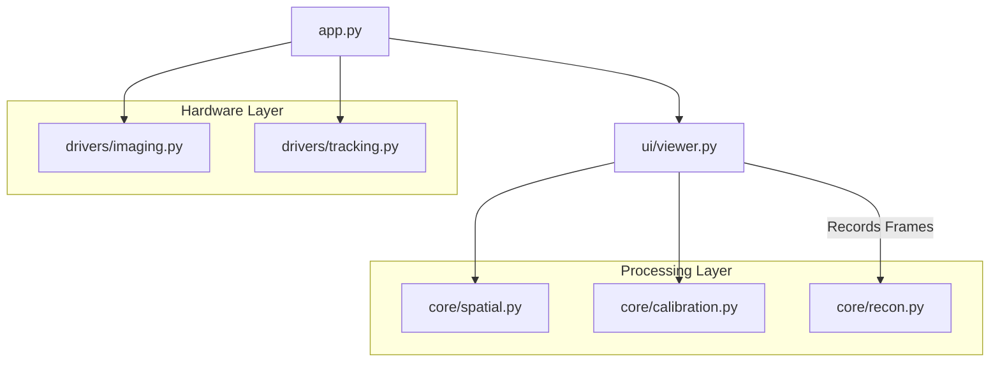

```mermaid
graph TD
    A[app.py] --> B[ui/viewer.py]
    A --> C[drivers/imaging.py]
    A --> D[drivers/tracking.py]
    
    B --> E[core/spatial.py]
    B --> F[core/calibration.py]
    
    subgraph "Hardware Layer"
    C
    D
    end
    
    subgraph "Processing Layer"
    E
    F
    G[core/recon.py]
    end
    
    B -- "Records Frames" --> G
```
