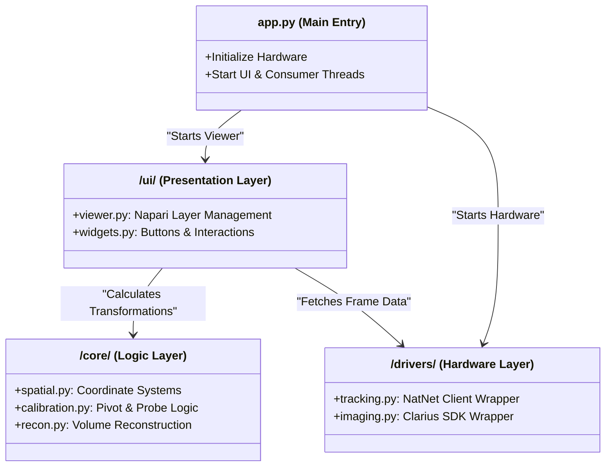

```mermaid
classDiagram
    class App ["app.py (Main Entry)"] {
        +Initialize Hardware
        +Start UI & Consumer Threads
    }

    class Core ["/core/ (Logic Layer)"] {
        +spatial.py: Coordinate Systems
        +calibration.py: Pivot & Probe Logic
        +recon.py: Volume Reconstruction
    }

    class Drivers ["/drivers/ (Hardware Layer)"] {
        +tracking.py: NatNet Client Wrapper
        +imaging.py: Clarius SDK Wrapper
    }

    class UI ["/ui/ (Presentation Layer)"] {
        +viewer.py: Napari Layer Management
        +widgets.py: Buttons & Interactions
    }

    App --> UI : "Starts Viewer"
    App --> Drivers : "Starts Hardware"
    UI --> Core : "Calculates Transformations"
    UI --> Drivers : "Fetches Frame Data"
```
